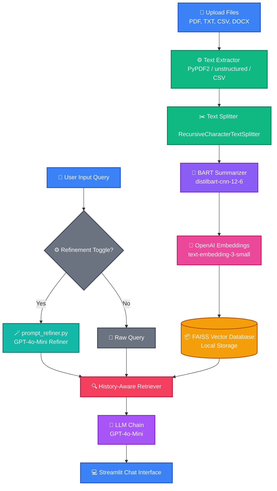

# 📄 ChatDoc: RAG-Powered Multi-Document Chatbot

Welcome to the **ChatDoc** repository! Developed by **Saumojit Roy**, this project enables interactive, conversational document retrieval and querying using **Retrieval-Augmented Generation (RAG)**. 

By integrating a RAG pipeline with a modern **Streamlit** user interface, ChatDoc allows you to upload and seamlessly query multiple document formats (PDF, TXT, CSV, DOCX) in natural language.

---

## 📚 Table of Contents

- [✨ Overview](#-overview)
- [🚀 Features](#-features)
- [🗂️ File Structure](#️-file-structure)
- [📋 Prerequisites](#-prerequisites)
- [💻 Installation & Setup](#-installation--setup)
  - [Windows Setup (PowerShell / CMD)](#windows-setup-powershell--cmd)
  - [macOS / Linux Setup](#macos--linux-setup)
- [🎨 System Design & Architecture](#-system-design--architecture)
- [📝 Usage Guide](#-usage-guide)
- [🙌 Acknowledgments](#-acknowledgments)
- [📜 License](#-license)

---

## ✨ Overview

ChatDoc utilizes the RAG framework to enhance information retrieval from uploaded documents. Rather than relying on simple keyword matching, it leverages context-aware embeddings and generative AI to provide accurate, natural answers.

### Key Highlights
- **Summarization Pipeline**: Accelerates query responses and improves embedding context by pre-summarizing text chunks using BART (`distilbart-cnn-12-6`).
- **Conversational Memory**: Retains conversation history to maintain context over multi-turn dialogues.
- **Prompt Refinement**: Toggle-able query refiner that cleans up ambiguities and typos in questions using an LLM before matching context.

---

## 🚀 Features

- **Multi-Format Document Upload**: Upload and query multiple documents simultaneously (`.pdf`, `.txt`, `.csv`, `.docx`).
- **AI-Powered Chat**: Ask questions using natural language and receive contextually backed answers.
- **Intelligent Summarization**: Automatically processes and condenses large chunks of text for high-fidelity vector matching.
- **Optional Prompt Refinement**: Enable the prompt refiner via the sidebar settings to restructure questions automatically for better precision.
- **Dynamic Streamlit UI**: A clean, premium dashboard with instant feedback, file checklists, and chat history controls.

---

## 🗂️ File Structure

```plaintext
.
├── icons/                    # UI Assets
│   ├── bot-icon.png
│   └── user-icon.png
├── src/                      # Source Code
│   ├── app.py                # Main Streamlit Application Entrypoint
│   ├── conversation.py       # RAG Retrieval Chains & Chat Integration
│   ├── document_utils.py     # Document Text Extraction & Summarization (BART)
│   ├── htmlTemplates.py      # Custom CSS & HTML Styles for User/Bot Bubbles
│   ├── prompt_refiner.py     # LLM-based Prompt Optimization logic
│   └── text_processing.py    # Text Chunking and Vector Store Generation (FAISS)
├── test/                     # Sample Test Files
│   ├── test.pdf
│   └── test.txt
├── .env                      # API Credentials Configuration (Private)
├── .gitignore                # Git Ignore Rules
├── LICENSE                   # MIT License file
├── pyproject.toml            # Project Dependencies & Metadata (Hatchling)
├── README.md                 # Project Documentation (This file)
├── setup.sh                  # Interactive bash setup script for Linux/macOS
└── uv.lock                   # Lockfile for environment dependency management
```

---

## 📋 Prerequisites

Ensure you have the following installed on your system:

1. **Python 3.9+**
2. **UV Package Manager** (Highly recommended for lightning-fast installation)
   - To install `uv`, run:
     ```bash
     pip install uv
     ```
3. **API Keys**:
   - **OpenAI API Key**: Required for GPT models (`gpt-4o-mini`) and OpenAI text embeddings.
   - **Hugging Face Token** (Optional): Fallback token for Hugging Face Inference API if the local summarizer model fails to load.

---

## 💻 Installation & Setup

### 1. Clone the Repository
Clone this repository to your local machine and navigate into it:
```bash
git clone https://github.com/mimozing3003/chatdoc.git
cd chatdoc
```

### 2. Configure Environment Variables
Create a file named `.env` in the root directory:
```env
OPENAI_API_KEY=your_openai_api_key_here
HUGGINGFACE_API_KEY=your_huggingface_api_key_here
```

---

### Windows Setup (PowerShell / CMD)

Since Windows environments do not natively execute `.sh` scripts via command line, follow these steps in your PowerShell or CMD terminal:

1. **Create and Activate a Virtual Environment**:
   ```powershell
   # Using uv (Recommended)
   uv venv --python 3.9
   .venv\Scripts\activate

   # Or using standard python
   python -m venv .venv
   .venv\Scripts\activate
   ```

2. **Install Dependencies**:
   ```powershell
   # Using uv (Recommended)
   uv sync

   # Or using pip
   pip install -e .
   ```

3. **Run the Application**:
   ```powershell
   streamlit run src/app.py
   ```

---

### macOS / Linux Setup

You can use the interactive setup script to configure your environment and run the application:

1. **Make the setup script executable**:
   ```bash
   chmod +x setup.sh
   ```

2. **Execute the script**:
   ```bash
   ./setup.sh
   ```
   Choose `1` to sync dependencies, or select the option to run with the Streamlit interface.

---

## 🎨 System Design & Architecture

The architecture of **ChatDoc** is structured to run efficiently by using pre-summarized document chunks. This prevents LLM context-window bloating and improves the retrieval relevance score of vector lookups.

Here is the step-by-step layout of how data flows through ChatDoc:



### Component Details
1. **Document Loading**: Text is parsed according to file type (PyPDF2 for PDFs, csv reader for CSVs, unstructured for Word docs).
2. **Text Chunking**: Text is split into overlapping chunks of 500 characters using `RecursiveCharacterTextSplitter`.
3. **Chunk-Level Summarization**: Rather than embedding full, dense text blocks, the chunks are summarized using `sshleifer/distilbart-cnn-12-6` to retain critical details while reducing noise.
4. **Vector Retrieval**: Embeddings are generated using `text-embedding-3-small` and stored in a FAISS index.
5. **Conversational QA**: LangChain's `create_history_aware_retriever` combines chat history with the current question to generate the final response using `gpt-4o-mini`.

---

## 📝 Usage Guide

1. **Launch the Interface**: Access [http://localhost:8501](http://localhost:8501) (or the port specified in the terminal).
2. **Configure Settings**:
   - In the sidebar, toggle **"Enable Prompt Refinement"** if you want the chatbot to refine your questions for improved accuracy.
3. **Upload Documents**: Drag and drop your `.pdf`, `.txt`, `.csv`, or `.docx` files in the sidebar.
4. **Process Files**: Click the **Process** button. This will extract raw text, run the summarizer model, and create a FAISS vector store.
5. **Chat**: Once processing is complete, type your queries into the chat box at the bottom.

---

## 🙌 Acknowledgments

Special thanks to the open-source libraries that make this possible:
- **Streamlit**: For the fast, beautiful web UI.
- **LangChain**: For core agentic logic and retriever orchestration.
- **OpenAI**: For state-of-the-art embedding and reasoning models.
- **FAISS**: For rapid, local vector index similarity searching.
- **Hugging Face / Transformers**: For the summarization models.

---

## 📜 License

This repository is licensed under the [MIT License](LICENSE). Feel free to adapt and build upon this project for your own use cases.
